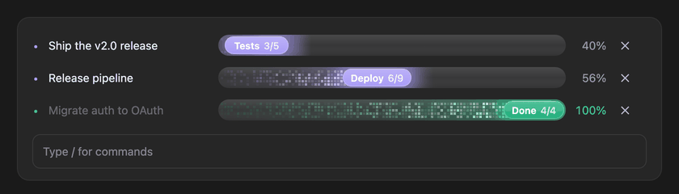
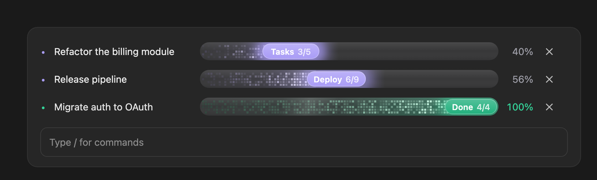
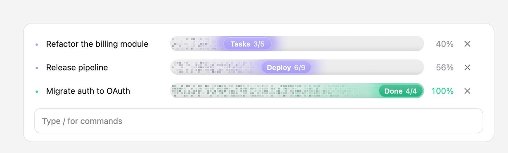
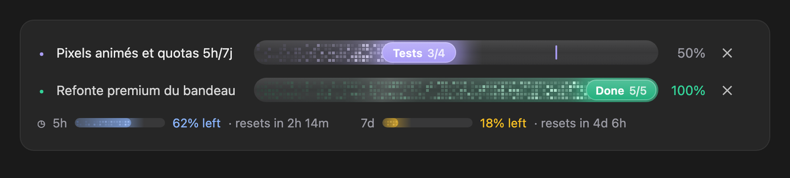
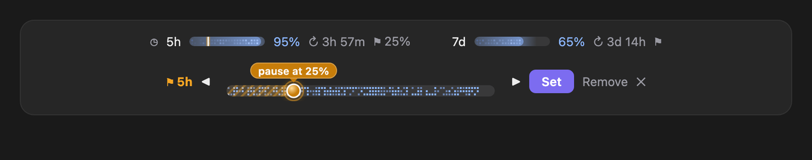
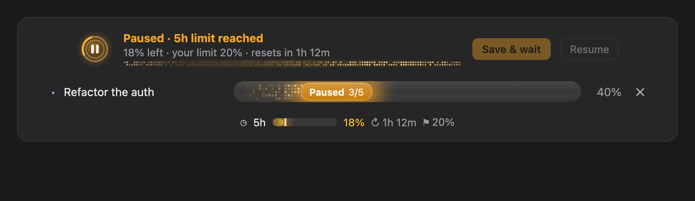
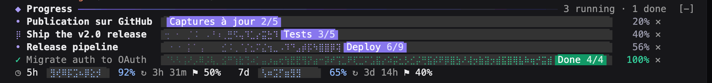

# progress

Un mod Claude Code (function hooks) qui affiche un **bandeau de progression animé au-dessus du prompt** : une ligne par plan avec son nom, une barre en matrice de LED, une pastille lumineuse « étape n/total » qui suit la tête, le pourcentage et un bouton `✕`. Claude signale lui-même son avancement en appelant l'outil `report_progress` que le mod enregistre. Un carillon joue quand une étape se termine, un arpège quand le plan entier est fini. Sous les plans, une ligne montre ce qu'il reste des limites de 5 heures et de 7 jours du forfait. Chaque dossier de projet a son propre bandeau. L'état vit dans `$.store` : il survit à un redémarrage.



*Les vraies barres SVG du mod, rendues par Chrome image par image avec leurs animations SMIL et CSS figées à des instants exacts, sur un panneau qui imite le Code tab.*

## Le rendu

**Dans l'app Desktop** (Code tab), chaque barre est un SVG dessiné comme une image, sans fond propre, dans les deux thèmes :

- **La piste** : une capsule légèrement bombée, un souffle de lumière en haut et une ombre en bas.
- **La matrice de LED** : une grille régulière de pixels de 3 px. Ils sont rares et sombres au départ, denses et lumineux près de la tête, chacun avec sa propre luminosité. Une rampe de couleur va du violet sombre au lavande presque blanc. Ils sont regroupés en quelques `path` par niveau, pour que le document reste léger : 26 000 caractères au pire.
- **Le halo** : une lueur continue, sans aucun bord net. Elle culmine au bord gauche de la pastille, passe dessous et s'estompe après elle.
- **La pastille** : un dégradé lavande avec un liseré clair et une lueur floutée derrière elle. Elle affiche l'étape en cours, par exemple « Tests 3/5 » quand deux étapes sur cinq sont finies. Elle passe à « Done 4/4 » en émeraude à la fin.
- **Le mouvement** : un nouveau rapport fait glisser la pastille avec un ralenti, et les pixels se dévoilent derrière elle. Les LED scintillent en permanence, plans terminés compris, et une lumière lente traverse la barre de temps en temps. Pendant que Claude travaille sur le plan, le scintillement s'accélère, la lumière passe plus souvent et la lueur de la pastille respire.




**Dans le terminal**, la même idée en cellules : la matrice est faite de caractères braille dont les points s'allument plus souvent vers la tête, en lavande sur la piste. La pastille est arrondie par des demi-blocs. Les points se redistribuent en permanence, environ 7 fois par seconde pendant le travail et 2 à 3 fois au repos. Une boucle `$.clock.every` repeint les deux `Raster` du bandeau avec `$.ui.blit`, sans repasser par `ui.render`, et s'arrête quand le bandeau est replié.

## Les limites de 5 h et de 7 jours

Sous les plans, une ligne compacte montre ce qu'il reste de chaque fenêtre du forfait : une mini-jauge en LED, `62%` et le compte à rebours `↻ 2h 14m`. La couleur passe du bleu à l'ambre sous 25 %, puis au rouge sous 10 %. La ligne s'affiche aussi seule quand aucun plan n'est en cours.



Le moteur expose le pourcentage utilisé de chaque fenêtre et son heure de remise à zéro, pas un nombre de tokens : le mod affiche donc ce qui reste en pourcentage. Les chiffres viennent de `$.session.usage()` au démarrage, puis de l'événement `session.measure`, qui les pousse après chaque tour et dès qu'une fenêtre bouge d'un point. Un minuteur d'une minute garde le compte à rebours à jour. Hors abonnement, le moteur n'a pas ces fenêtres et la ligne n'apparaît pas. L'option `usage` la masque.

## Une limite qui met le travail en pause

Un clic sur « 5h » ou « 7d », ou sur le drapeau `⚑` à côté, ouvre un sélecteur en une ligne autour d'une grande jauge. La jauge montre ce qui reste de la fenêtre en LED. Sous la souris, une bulle indique le pourcentage pointé. Un clic gauche pose la limite à cet endroit, et elle est enregistrée tout de suite : une barre lumineuse se dresse dans la piste, la zone d'arrêt se hachure en ambre et une bulle « pause at 40% » la surmonte. Un nouveau clic la déplace, avec un glissement animé. La limite se cale sur des pas de 5 %, de 5 à 90 %. `Remove` la retire et `✕` ferme le sélecteur. Une fois réglée, la limite s'affiche en `⚑ 40%` et une encoche ambre la marque sur la mini-jauge. Les limites valent pour tout le compte, comme les fenêtres.

Le survol et le clic passent par des éléments que toutes les surfaces savent dessiner : une rangée de 18 boutons invisibles posée sur la piste, chacun avec une bulle révélée au survol par la surface elle-même. Dans le terminal, `◀` et `▶`, ou les touches `h` et `l`, déplacent la limite et `Set` la valide. La souris y passe aussi par une couche `Client` (`hooks/views/dial-drag.tsx`) là où le terminal la transmet.



Quand une fenêtre descend à sa limite, le mod :

- interrompt le tour en cours avec `$.turn.abort` ;
- refuse tout appel d'outil, sauf `report_progress`, avec un message qui dit à Claude de s'arrêter ;
- passe les barres des plans en ambre, marquées « Paused » ;
- joue `fx/alert.wav` et affiche une carte d'alerte animée : un emblème à anneaux sonar et arc en comète, le reste de la fenêtre, la limite et la remise à zéro, et une vague de LED qui défile.



La carte propose deux suites :

- **Save & wait** : Claude écrit un point d'étape en trois lignes, sans outils. La carte passe en indigo, avec une horloge et un arc qui suit l'attente. Vingt secondes après la remise à zéro de la fenêtre, le mod relance Claude depuis ce point d'étape. L'attente survit à un redémarrage.
- **Resume** : le travail reprend tout de suite, et Claude est relancé si un tour avait été interrompu. Cette fenêtre ne se redéclenche plus avant sa remise à zéro.

Écrire soi-même un message à Claude pendant la pause compte aussi comme une reprise.

## Un bandeau par dossier

Le store d'un plugin est partagé par toutes les sessions de la machine. Le mod range donc chaque plan sous le dossier racine du projet, `$.session.root()`, avec une clé `plan:<dossier>:<plan>`. Chaque conversation ne voit que les plans de son dossier : deux projets différents ont chacun leur bandeau, et deux conversations dans le même dossier partagent le leur. Le bandeau relit le store chaque minute : un plan lancé, avancé, terminé ou retiré par une autre conversation du dossier apparaît dans la minute, avec la même animation de remplissage et le même flash. Les sons restent réservés à la conversation qui fait le travail. `/progress clear` ne vide que le dossier courant.

Les plans de la première version n'avaient pas de dossier. Au chargement, ceux qui sont terminés sont supprimés. Un plan encore en cours n'est affiché nulle part : il est adopté par la première conversation qui le signale à nouveau.



*Capturé dans une vraie session `claude --plugin-dir ./progress` (Claude Code 2.1.287), Claude appelant `report_progress` lui-même.*

## Replier la liste

Le bouton `▾`, au début de la ligne des quotas, replie tous les plans en une seule ligne : « 2 running · 1 done », une capsule qui contient une mini-barre de LED par plan (émeraude pour les plans terminés, lavande pour ceux en cours), puis le pourcentage global. Au repli, les mini-barres arrivent une à une depuis la droite et se posent avec un flash, puis un trait de lumière balaie toute la capsule. Le bouton devient `▸ 3 tasks`. Un clic rouvre la liste : chaque barre se dévoile de gauche à droite derrière un bord lumineux, avec un léger décalage d'une ligne à l'autre. La ligne des quotas reste en dessous. Le choix est retenu par dossier, dans `view:<dossier>`. Dans le terminal, la ligne repliée est un seul `Raster` qui contient les mini-jauges braille, et la boucle d'animation ne repeint plus les lignes qui ne sont pas affichées.

## Le `✕` qui dissout

Le `✕` ne fait pas disparaître la ligne d'un coup. Sur Desktop, chaque LED se détache, s'envole à son propre angle en s'illuminant de blanc puis s'éteint, en partant de la pastille. La pastille gonfle puis éclate. L'éclat est dessiné sur une couche à lui, posée au premier plan et plus grande que la ligne, pour que rien ne le coupe. Il enchaîne un flash radial, une onde de choc blanche et vive suivie d'une onde colorée et diffuse, une étoile de traînées d'étincelles et des paillettes qui retombent. La piste s'efface ensuite. Dans le terminal, les cellules se changent en étincelles `✦` puis `·` avant de s'éteindre, et la pastille s'effrite. Le nom du plan se raye pendant ce temps, avec le son `fx/dissolve.wav` : un souffle qui retombe et quelques reflets cristallins. Après un peu plus d'une seconde, le plan quitte le bandeau et le store.

## Ce que ça fait

| Hook | Ce qu'il fait |
| --- | --- |
| `session.start` | Enregistre l'outil `report_progress` (`$.tool.register`) et la commande `/progress` (`$.command.register`, `immediate`), puis charge les plans depuis `$.store`. |
| `tool.describe` sur l'outil | Le garde listé dans le prompt plutôt que derrière ToolSearch, pour que Claude l'utilise sans le chercher. |
| `tool.call` sur `mcp__progress__report_progress` | Lit l'appel (`plan`, `step`, `total`, `note`, `done`, `remove`), met le plan à jour, l'enregistre sous `plan:<id>`, lance l'animation de remplissage (et le flash si le plan se termine), redessine, puis joue `fx/step-done.wav` ou `fx/plan-done.wav` sans retenir la réponse de l'outil. Un `.catch` renvoie l'erreur au modèle plutôt que de laisser l'appel sans réponse. |
| `ui.render` sur `AbovePrompt` | Dessine l'en-tête puis une ligne par plan, au-dessus de ce que dessinent les mods en dessous (`await next(e)`). Laisse le bandeau tel quel sans plan ou pendant un sondage. |
| `turn.start` | Relit le store, pour afficher les plans signalés par une autre session du même dossier, et lance le spinner. |
| `session.measure` | Met à jour les fenêtres de 5 h et de 7 jours quand le moteur les mesure. |
| `turn.complete` | Arrête le spinner et le reflet à la fin du tour principal. |
| `command.run` sur `progress` | `/progress` liste les plans, `/progress clear` les supprime tous, `/progress remove <plan>` en supprime un. |
| `prompt.compose` | Ajoute une courte section au prompt système, quand l'outil est offert, pour demander à Claude de signaler son avancement. |

Appels sur `$` : `audio.play`, `clock.every`, `clock.now`, `command.register`, `session.root`, `session.usage`, `store.delete`, `store.get`, `store.keys`, `store.set`, `tool.register`, `ui.blit`, `ui.invalidate`, `ui.resolve`.

### L'outil `report_progress`

| Champ | Type | Rôle |
| --- | --- | --- |
| `plan` | string, requis | Le nom du plan, étiquette de la ligne ; le même nom met la ligne à jour. |
| `step` | integer ≥ 0 | Étapes terminées. |
| `total` | integer ≥ 1 | Nombre d'étapes ; requis à la première mention d'un plan. |
| `note` | string | L'étape qui commence, en un à trois mots (« Tests », « Deploy ») : le texte de la pastille. |
| `done` | boolean | `true` quand le plan est fini : `step` devient `total`. |
| `remove` | boolean | `true` pour retirer la ligne. |

La pastille affiche l'étape en cours, `step + 1`, et le pourcentage les étapes terminées : « Tests 3/5 » à 40 %. Le pourcentage plafonne à 99 % tant que `step < total`.

### Options

Les deux options sont des booléens, à `true` par défaut, visibles dans `/config`.

- `usage` affiche la ligne des limites de 5 h et de 7 jours.
- `sound` joue les deux sons. `fx/step-done.wav` est un « ti-ding » de verre, deux notes à la quinte. `fx/plan-done.wav` est un arpège do-mi-sol-do avec une étincelle aiguë et une réverbération courte. Les deux sont synthétisés en Python, sans dépendance.

## Fichiers

```text
progress/
├── .claude-plugin/
│   ├── plugin.json              # manifeste (userConfig: sound)
│   └── types/                   # écrit par Claude Code au chargement (ignoré par git)
├── hooks/
│   ├── hooks.json               # "modules": ["./register.ts"]
│   ├── register.ts              # les hooks, la boucle d'animation, les helpers qui prennent $
│   ├── plans.ts                 # le modèle : Plan, reportOf, applied, chipOf, les clés par dossier…
│   ├── usage.ts                 # les fenêtres de 5 h et de 7 jours : reste, couleur, compte à rebours
│   ├── guard.ts                 # les limites et la pause : dépassement, état, messages à Claude
│   ├── meter.ts                 # le terminal : pixels braille, pastille, pourcentage, icône, filet, dissolution
│   ├── motion.ts                # les durées, l'easing, le spinner, le scintillement
│   ├── palette.ts               # les couleurs, le bruit déterministe des pixels
│   ├── raster.ts                # l'encodage base64 des cellules d'un Raster (et son décodage pour les tests)
│   └── views/
│       ├── band.tsx             # le bandeau en JSX : terminal, Desktop, texte
│       ├── svg-bar.ts           # la barre SVG du Desktop : matrice de LED, halo, pastille
│       ├── svg-alert.ts         # l'emblème et la vague de l'alerte, le sélecteur de limite
│       ├── guard.tsx            # la carte d'alerte, le sélecteur, les boutons de limite
│       └── dial-drag.tsx        # la couche Client qui fait glisser le curseur de limite
├── fx/
│   ├── step-done.wav
│   ├── plan-done.wav
│   ├── alert.wav
│   └── dissolve.wav
├── screenshots/                 # le GIF et les captures de ce README
├── tests/register.test.ts       # 26 tests pour `claude plugin test`
└── tsconfig.json
```

## Installer

Prérequis : Claude Code ≥ 2.1.287, où les mods sont actifs par défaut, et un CLI connecté (`claude auth login`). L'activation des mods est servie par compte : un CLI déconnecté refuse tout hooks module avec « the rollout switch served off ».

Depuis le marketplace `nyxstudio-mods` de ce dépôt :

```sh
claude plugin marketplace add Certicore/ClaudeMOD
claude plugin install progress@nyxstudio-mods
```

Ou pour une seule session, depuis un clone du dépôt :

```sh
claude --plugin-dir ./progress
```

Puis demander un travail en plusieurs étapes, par exemple « fais ce refactor en 4 étapes ». Le bandeau apparaît dès le premier appel de `report_progress`. `/progress` liste les plans. `✕`, au clic ou au clavier après ctrl+x tab, retire une ligne. Le rendu est le plus beau dans un terminal true-color (Ghostty, iTerm2, WezTerm, kitty, Terminal de macOS 26).

## Vérifier

```sh
claude plugin validate --strict ./progress   # analyse statique : hooks et appels
npx -p typescript tsc -p ./progress          # typage de hooks/ et tests/
claude plugin test ./progress                # les 26 tests
```

Les tests stubbent le monde sous le mod (`store.*`, `audio.play`, `ui.blit`, `tool.register`, `ui.render`, l'horloge avec `mock.clock`), montent le bandeau avec `$.ui.mount` sur les surfaces terminal et Desktop, décodent les cellules des `Raster` pour lire la pastille et le pourcentage, lisent le SVG du Desktop, avancent l'horloge pour suivre le remplissage, et pressent `✕`. Un test couvre le rechargement à chaud : un module rechargé qui reçoit un appel avant son `session.start` relit d'abord le store.

## Limites

- **Un bandeau par session.** Le mod garde ce que les mods en dessous y dessinent, mais un mod placé avant lui dans la chaîne peut le remplacer. Un sondage de Claude Code prend la place du bandeau tant qu'il est affiché.
- **Un même dossier partage son bandeau** : deux conversations dans un même projet voient les mêmes plans, et `✕` dans l'une retire le plan dans l'autre.
- **Le terminal** dépend de sa police pour les points braille : ils sont plus fins dans certaines polices.
- **Le son** passe par le lecteur de la plateforme (`afplay` sur macOS) ; sans lecteur, le bandeau se met à jour en silence.
- `AbovePrompt` est dessiné dans le terminal et le Code tab de l'app Desktop, pas dans VS Code ni en `-p`.
